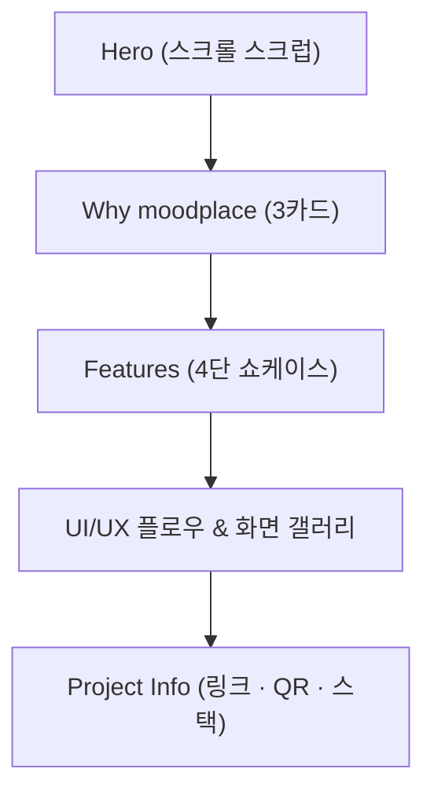

# 🌤️ my moodplace — 서비스 소개 페이지

> 원하는 무드를 찾아내는 검색 어플, my moodplace를 소개하는 스크롤 기반 랜딩페이지

<p>
  
  
  
  
  
</p>

## 🖼️ 데모
| Hero 스크롤 인터랙션 | Features 섹션 | UI/UX 화면 갤러리 |
|---|---|---|
| (스크린샷 삽입) | (스크린샷 삽입) | (스크린샷 삽입) |

배포 링크: https://tmdnd0568.github.io/site/ · 소개 대상 앱: https://moodplace001.vercel.app/

## 📖 소개
my moodplace는 SNS의 세부 분위기·스타일 필터링 한계를 해결하는 **무드(분위기) 기반 카페 검색 앱**입니다. 이 저장소는 앱스토어 미배포 상태의 my moodplace를 소개하고, 웹으로 바로 체험할 수 있도록 QR 코드까지 제공하는 원페이지 소개 사이트입니다.

## ✨ 주요 기능 & 인터랙션

### 1. Hero 스크롤 스크럽(Scroll-scrub) 연출
`<canvas>`를 이용해 스크롤 위치에 따라 히어로 장면이 재생되고, 스크롤이 끝나는 지점에서 실제 앱 목업 이미지와 QR 코드가 담긴 엔딩 화면으로 자연스럽게 전환됩니다. 첫 화면부터 "지금 이 기분에 맞는 카페를 찾는다"는 서비스 컨셉을 스크롤 자체로 체험하게 만든 부분입니다.

### 2. Why moodplace — 3가지 차별점 소개
AI 기반 무드 맞춤 검색, 카테고리별 핫플레이스 탐색, 붐비는 카페 예약 연동이라는 세 가지 강점을 카드형 레이아웃으로 소개합니다. 기존 카페 검색 앱과의 차이를 첫 화면 스크롤 직후 바로 이해시키는 것을 목표로 배치했습니다.

### 3. Features 4단 쇼케이스
스크롤 시 순차적으로 드러나는(reveal) 4개의 기능 행(row)으로 Mood Search, Custom Route, Place & Reserve, Mood Archiving을 소개합니다. 각 행마다 실제 앱 목업 이미지, 뜨는(float) 해시태그 칩, 팝아웃 카드 애니메이션을 함께 배치해 기능을 텍스트가 아닌 화면으로 체감하도록 구성했습니다.

## 🧭 사용자 플로우


## 🗂️ 폴더 구조
```
site/
├── assets/            # 로고 등 공용 에셋
├── scroll/            # Hero 스크롤 스크럽용 이미지 시퀀스
├── 로고/               # 로고 원본 파일
├── 목업/               # 앱 목업 이미지 (구버전)
├── 목업2/              # 앱 목업 이미지 (현재 사용)
├── index.html          # 메인 소개 페이지
├── script.js           # 스크롤 인터랙션 · 갤러리 · QR 코드 스크립트
├── style.css           # 스타일시트
└── server.js           # 로컬 개발용 서버
```

## 🤖 AI 활용 프로세스
이 프로젝트는 기획 초안부터 카피라이팅까지 각 단계에서 AI를 1차 초안 생성 도구로 활용하고, 그 결과를 검증·수정하는 방식으로 진행했습니다.

**① 기획 단계 — Why moodplace 차별점 정리**
> "AI 기반 무드 맞춤 검색, 카테고리별 핫플레이스 탐색, 붐비는 카페 예약 연동" 3가지 차별점을 뽑아낼 때 사용한 프롬프트를 적어주세요.

AI가 제안한 초안 중 실제 서비스 방향과 맞지 않는 항목은 제외하고, 나머지를 기반으로 카드 문구를 직접 다듬었습니다. (실제 채택/수정 내용을 적어주세요.)

**② 디자인 단계 — 스크롤 스크럽 연출 기획**
> Hero 섹션의 스크롤 스크럽(이미지 시퀀스 재생) 연출 방식을 설계할 때 사용한 프롬프트를 적어주세요.

위 이미지들은 10초짜리 동영상을 프레임 단위로 끊어둔 이미지야 
이미지 n번쨰 에 도달하면 qr 코드와 목업이 올라오게 제작해줘 


**④ 트러블슈팅 — 원인 진단**
버그가 발생했을 때도 증상을 설명해 원인 후보를 먼저 받아본 뒤, 실제 원인을 좁혀 나갔습니다. (아래 트러블슈팅 표 참고)

## 🩹 트러블슈팅
| 이슈 | 원인 | 해결 |
|이미지가 자꾸 목업을 가리는 버그가 있엇습니다|이미지의 위치값이 조정이 잘못되어있엇습니다|정상 작동하게 다시 제작햇습니다.|
|---|---|---|
| UI/UX 갤러리 이미지 비율 깨짐 | 이미지 aspect-ratio 미지정 | aspect ratio 및 정렬 값 수정 |
| Hero 스크롤 유도가 약함 | 스크롤 큐 UI 부재 | 히어로 스크롤 유도 UI 개선 |

## 🚀 실행 방법
```bash
git clone https://github.com/tmdnd0568/site.git
cd site  
node server.js
```
또는 `index.html`을 브라우저로 직접 열어 정적으로 확인할 수 있습니다.

## 📄 라이선스
MIT
